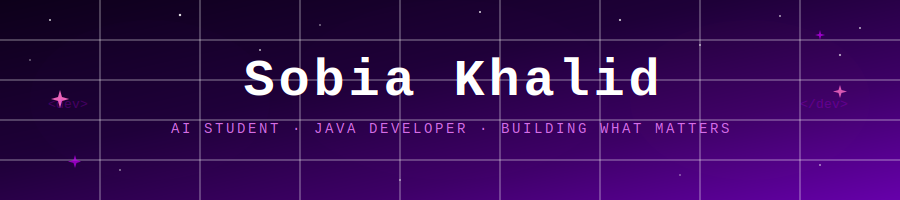

  

 

 

---

### 🌸 Currently Learning
Strengthening my fundamentals with **Java** and **C++** while exploring the world of **Artificial Intelligence**.

---

### 💻 Projects

🔐 **[Password Manager](https://github.com/Sobia-khalid770/Password-Manager)**
> A Java-based tool to generate strong passwords and save them securely.

🧸 **[SafeHaven AutismAid](https://github.com/Sobia-khalid770/SafeHaven-AutismAid)**
> A Java-built app designed especially for kids with autism, a safe and friendly digital space. 💙

---

### 💬 Ask me about
Java, C++, AI concepts & building apps that matter

---

### 🛠️ Languages and Tools

---

### 🌺 About Me

I'm **Sobia Khalid**, 18, a BS Artificial Intelligence student with a passion for building software that makes a real difference. I work with **Java** and **C++**, and I enjoy tackling problems that combine logic with empathy. My project **SafeHaven AutismAid** reflects exactly that — a Java-built application designed to create a safe, friendly digital experience for kids with autism. 💙

I'm actively growing my skills, open to learning, and looking forward to opportunities where I can contribute, collaborate, and keep building things that matter.

---

### 💌 Let's Connect!

*On the same journey or just want to say hi? My inbox is always open!*

 

---

  

